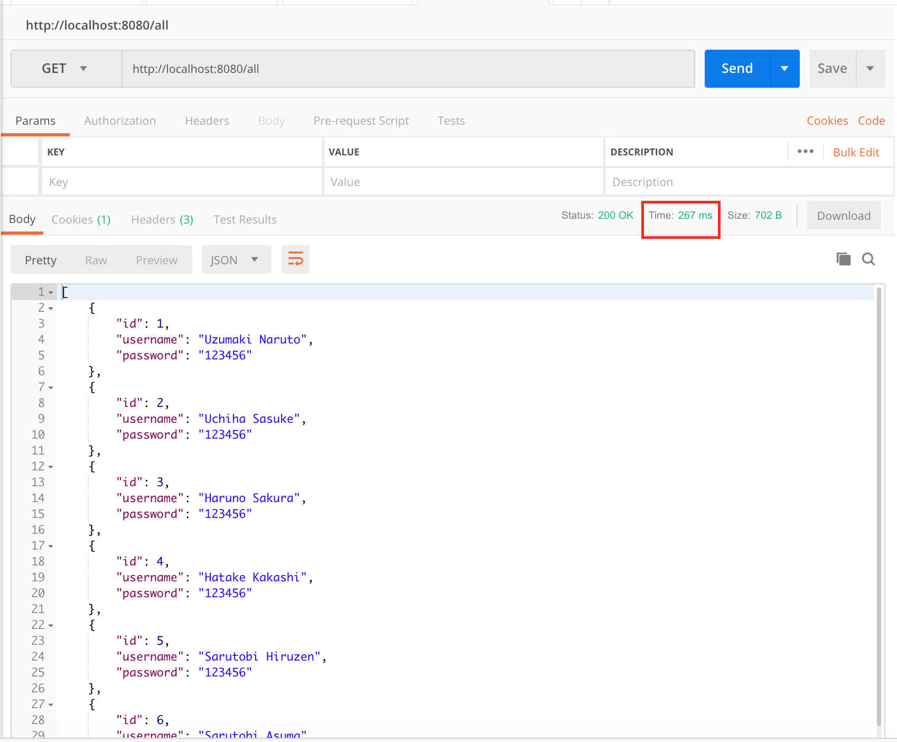
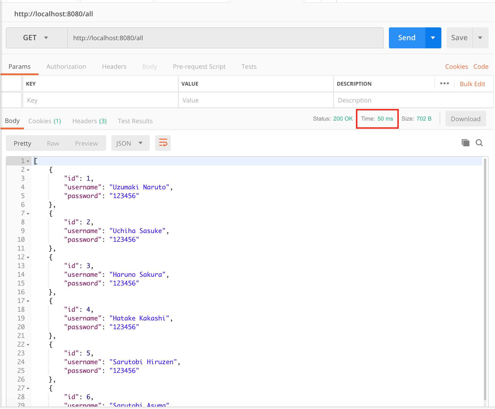

# Spring Boot Redis JPA

### This is just simple Spring Boot JPA Redis

To run this repo :

Run this command on your terminal : `mvn clean spring-boot:run`

Open your browser :

`http://localhost:8080/user?id=1&username=naruto&password=123456`

`http://localhost:8080/all`

### Screenshot

Before Redis

After Redis

### Happy Coding!

